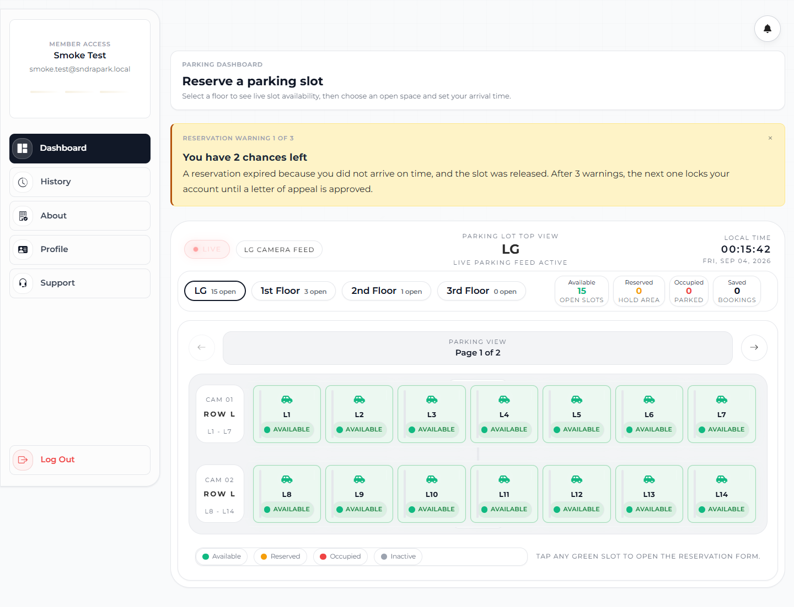
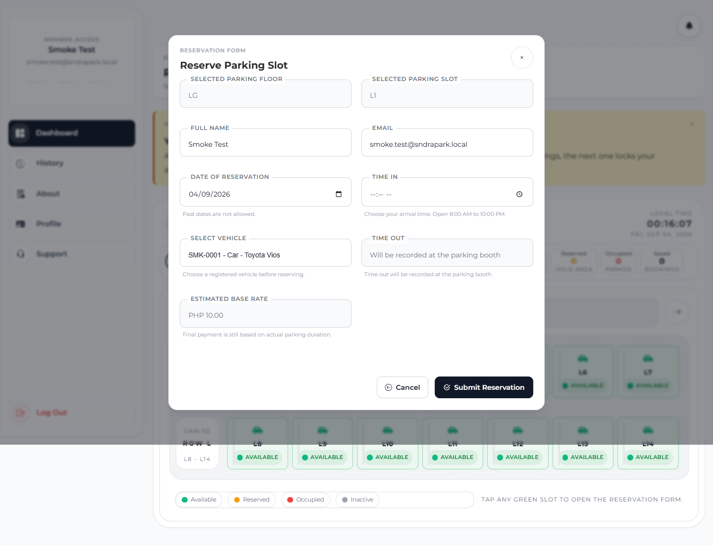
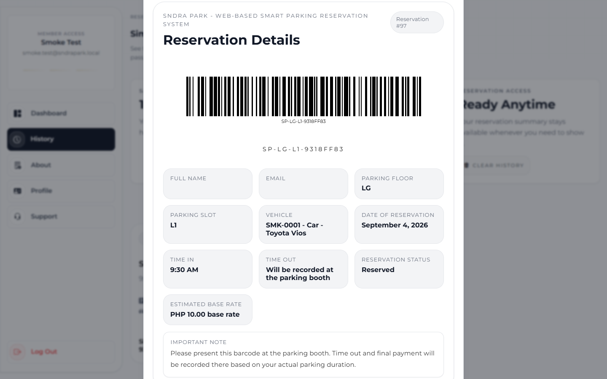
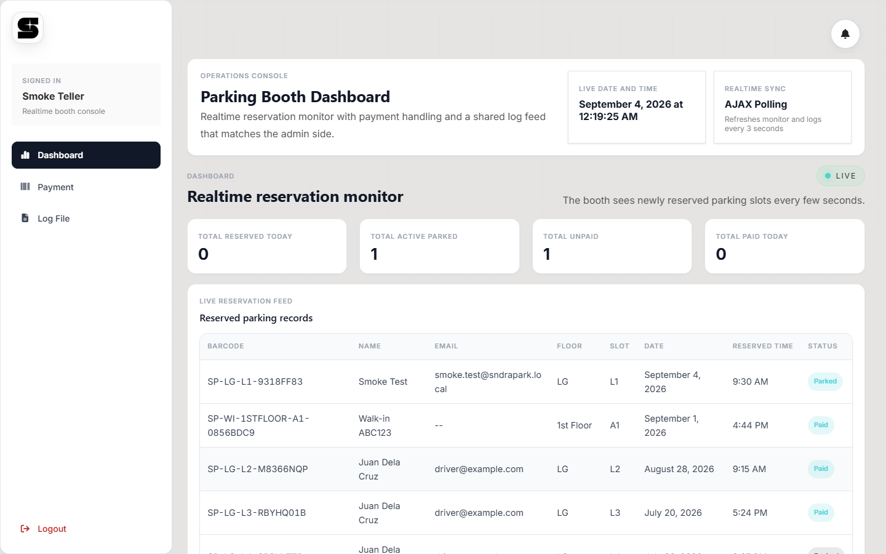
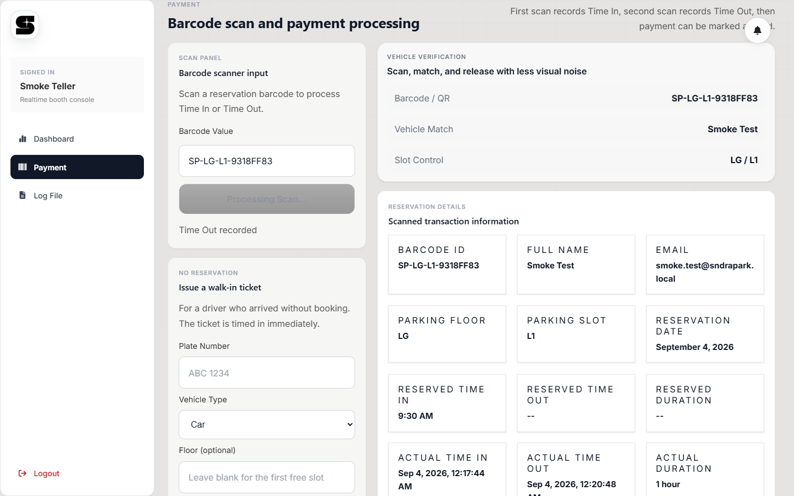
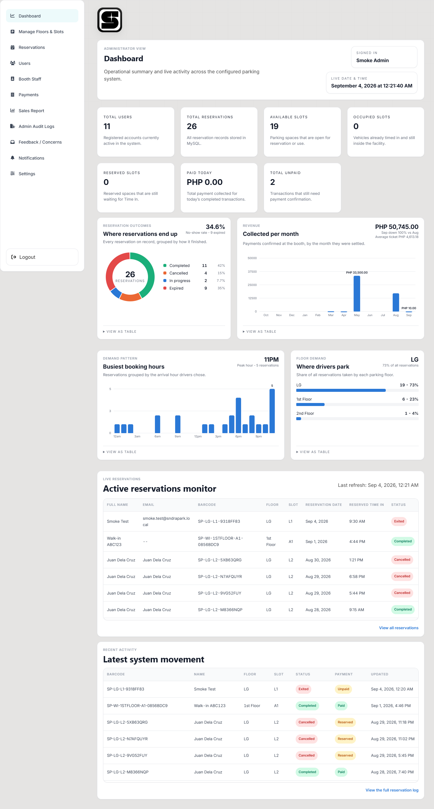
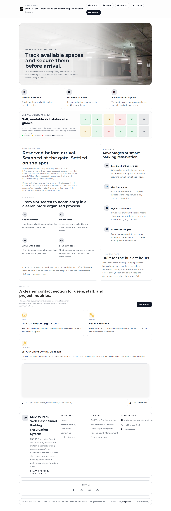

# SNDRA Park — Web-Based Smart Parking Reservation System

[](https://github.com/Katwalk12/SNDRAPark/actions/workflows/ci.yml)

A parking reservation platform for a multi-floor car park. A driver reserves a
specific bay before arriving and gets a barcode pass. At the gate, the booth
teller scans that pass to record Time In, scans it again on the way out to
record Time Out, and the system prices the stay and marks it paid. An
administrator watches the same live floor map, manages slots and staff, and
reads the revenue and demand reports.

One reservation record is shared by all three roles — the driver's booking, the
booth's transaction, and the admin's report row are the same row, so nothing has
to be reconciled by hand.

**Three roles, one record:**

| Role | Signs in with | Console |
|---|---|---|
| **Member** (driver) | Email + password, or Google sign-in | `user-dashboard.html` |
| **Booth teller** | 4-digit PIN | `parking-booth.html` |
| **Administrator** | Email + password (+ optional 2FA) | `admin-dashboard.html` |

---

## Table of contents

- [Demonstration](#demonstration)
- [Features](#features)
- [Tech stack](#tech-stack)
- [Requirements](#requirements)
- [Installation](#installation)
- [Running the system](#running-the-system)
- [Configuration](#configuration)
- [How pricing works](#how-pricing-works)
- [No-show policy](#no-show-policy)
- [Scheduled maintenance](#scheduled-maintenance)
- [Project structure](#project-structure)
- [API reference](#api-reference)
- [Tests and CI](#tests-and-ci)
- [Security](#security)
- [Troubleshooting](#troubleshooting)

---

## Demonstration

The walkthrough below is one reservation followed end to end, from the driver
picking a bay to the teller closing the transaction at the gate.

### 1. The member picks a floor and a free bay

The dashboard polls live slot status. Each floor shows its open count, and every
bay is colour-coded — green *Available*, amber *Reserved*, red *Occupied*, grey
*Inactive*. Tapping a green bay opens the reservation form. The banner at the
top is the no-show warning system telling this driver how many chances are left.



### 2. The reservation form

Floor and slot are locked to the bay that was tapped. The driver picks an
arrival time inside opening hours and one of their registered vehicles; the
estimated base rate is quoted up front. Time Out is deliberately left blank —
it is recorded at the booth, because the final price depends on the actual stay.



### 3. The pass is issued

Submitting mints a unique barcode (`SP-<FLOOR>-<SLOT>-<8 hex>`) and holds the
bay. The driver shows this at the gate; it doubles as the receipt reference.



### 4. The booth sees it appear

The teller console polls every three seconds, so a booking made seconds ago is
already on the monitor with its status, floor, slot, and reserved time.



### 5. The teller scans, prices, and releases

First scan records Time In and flips the bay to *Occupied*. The second scan
records Time Out, computes the total from the actual duration, and the
transaction can then be marked paid. A driver who arrives without a booking gets
a walk-in ticket from the same screen — timed in immediately, no reservation
needed.



### 6. The administrator sees the whole picture

Live counters, where reservations end up (completed / cancelled / expired),
revenue collected per month, the busiest booking hours, and which floors drivers
actually choose — plus the live reservation monitor and the shared activity log.



<details>
<summary>Public landing page</summary>



</details>

> Names and email addresses in these screenshots are placeholders.

---

## Features

### Member

- Register with a vehicle (plate, type, brand, model, colour); manage several
  vehicles from the dashboard
- Google sign-in as an alternative to email + password
- Live multi-floor slot map with per-floor open counts and paginated rows
- One active reservation at a time, with the base rate quoted before booking
- Barcode pass with full reservation details, viewable any time from History
- Cancel a reservation and release the bay
- Warning banner and account-lock notice when reservations are not honoured
- Letter of appeal submission when the account gets locked
- Support / feedback messages with admin replies
- Password reset by email OTP; password strength policy enforced on signup
- Installable as a PWA (`manifest.webmanifest` + `sw.js`)

### Booth teller

- PIN-only login (no username at the gate)
- Realtime reservation monitor, refreshed every 3 seconds
- Barcode scan for Time In, then Time Out — the same field does both
- Automatic pricing from the actual duration, with Senior / PWD statutory
  discounts and payment method selection
- Walk-in tickets for drivers who arrive without a booking
- Shared transaction log, matching what the admin sees
- Admin announcements shown on the console

### Administrator

- Operational dashboard: users, reservations, available / occupied / reserved
  slots, paid today, unpaid
- Charts — reservation outcomes, revenue per month, busiest booking hours,
  floor demand share
- Manage floors and slots: add, deactivate (with a reason drivers see),
  override a slot's status manually
- Reservations, payments, and a sales report
- User management with violation history and appeal handling
- Booth staff management (create tellers, rotate PINs)
- Feedback inbox with replies
- Broadcast notifications
- Admin audit log and system logs
- Settings: rates, opening hours, grace period, warning allowance, SMTP,
  optional admin 2FA

---

## Tech stack

| Layer | What is used |
|---|---|
| Server | PHP 8.2 (`mysqli` and PDO), Apache via XAMPP |
| Database | MySQL / MariaDB |
| Frontend | Vanilla JavaScript, hand-written CSS — no bundler, no framework |
| Email | PHPMailer (vendored in `backend/PHPMailer-master/`, no Composer) |
| Auth | PHP sessions, Google OAuth 2.0, bcrypt password hashes, PIN hashes |
| Tests | Plain PHP runner in [tests/run.php](tests/run.php) |
| CI | GitHub Actions — [.github/workflows/ci.yml](.github/workflows/ci.yml) |

There is no build step. Editing a `.php`, `.js`, or `.css` file and reloading
the page is the whole loop.

---

## Requirements

- **XAMPP** with **PHP 8.2+** and **MySQL / MariaDB**
- A browser (Chrome / Edge / Firefox)
- A Gmail account with an **App Password** if you want OTP and notification
  emails to actually send
- Google Cloud OAuth credentials if you want Google sign-in

---

## Installation

### 1. Put the project in the web root

```bash
git clone https://github.com/Katwalk12/SNDRAPark.git c:/xampp/htdocs/sndraPark
```

The folder name matters — the app is served from `/sndraPark/`. Start **Apache**
and **MySQL** from the XAMPP Control Panel.

### 2. Create the database

Open <http://localhost/phpmyadmin> and import, **in this order**:

| # | File | Creates |
|---|---|---|
| 1 | [database/database.sql](database/database.sql) | `sndrapark_db`, `users`, base tables |
| 2 | [database/parking_booth.sql](database/parking_booth.sql) | `reservations`, `parking_transactions`, `payments`, `notifications` |
| 3 | [database/parking_booth_xampp.sql](database/parking_booth_xampp.sql) | booth columns on the two reservation tables |
| 4 | [database/staff_auth.sql](database/staff_auth.sql) | `staff_accounts`, `staff_login_logs` |
| 5 | [database/admin_dashboard_updates.sql](database/admin_dashboard_updates.sql) | `parking_floors`, `system_settings`, `feedback_messages` |
| 6 | [database/realtime_dashboard_updates.sql](database/realtime_dashboard_updates.sql) | live monitor columns on slots and reservations |
| 7 | [database/booth_teller_pin_accounts.sql](database/booth_teller_pin_accounts.sql) | `booth_teller_accounts` |
| 8 | [database/vehicle_management.sql](database/vehicle_management.sql) + [database/users_vehicle_columns.sql](database/users_vehicle_columns.sql) | `vehicles` |
| 9 | [database/password_security_policy.sql](database/password_security_policy.sql) | lockout + password ageing |
| 10 | [database/forgot_password_email_otp.sql](database/forgot_password_email_otp.sql) | `password_resets` |
| 11 | [database/forgot_password_alter.sql](database/forgot_password_alter.sql) | `reset_otp_*` columns on `users` |
| 12 | [database/feedback_inbox_updates.sql](database/feedback_inbox_updates.sql) | feedback replies |
| 13 | [database/slot_unavailable_reason.sql](database/slot_unavailable_reason.sql) | out-of-service reasons |

Then apply the security schema (audit log, rate limiting, roles, session
columns):

```bash
c:\xampp\php\php.exe database\run_security_migrations.php
```

Every migration is written with `IF NOT EXISTS`, so re-running one is safe.

Four tables are not in any `.sql` file — `system_logs`, `admin_audit_logs`,
`user_violations`, and `notification_reads` are created on first use by
`backend/config/database.php` and `backend/notifications/common.php`. You do not
need to create them by hand.

> The `smtp_settings` table is legacy. SMTP credentials come from `.env` now;
> nothing reads that table any more.

### 3. Configure the environment

```bash
cp .env.example .env
```

Fill in `.env` — see [Configuration](#configuration). **`.env` is git-ignored
and must never be committed**; CI fails the build if it ever is.

### 4. Create the first accounts

- **Member** — sign up at `frontend/pages/signup.html`.
- **Administrator** — insert a row into `staff_accounts` with `role = 'admin'`
  and a bcrypt `password_hash`:

  ```bash
  c:\xampp\php\php.exe -r "echo password_hash('YourStrongPassword', PASSWORD_DEFAULT);"
  ```

- **Booth teller** — add the teller from the admin console (Booth Staff), or
  insert into `booth_teller_accounts` with a hashed 4-digit `pin_code`. Keep
  every PIN unique: booth login matches the PIN against all active tellers, so a
  duplicate would sign in as whichever row matches first.

---

## Running the system

Open <http://localhost/sndraPark/> — [index.php](index.php) redirects to the
landing page.

| Screen | URL |
|---|---|
| Landing page | `/sndraPark/frontend/pages/index.html` |
| Member login | `/sndraPark/frontend/pages/login.html` |
| Member signup | `/sndraPark/frontend/pages/signup.html` |
| Member dashboard | `/sndraPark/frontend/pages/user-dashboard.html` |
| Booth login (PIN) | `/sndraPark/frontend/pages/booth-login.html` |
| Booth console | `/sndraPark/frontend/pages/parking-booth.html` |
| Admin login | `/sndraPark/frontend/pages/admin-login.html` |
| Admin dashboard | `/sndraPark/frontend/pages/admin-dashboard.html` |

Sessions expire after 30 minutes of inactivity.

### Trying the full flow

1. Sign up as a member and register a vehicle.
2. On the dashboard, pick a floor, tap a green bay, choose an arrival time
   inside opening hours, submit.
3. Open **History → View** and note the barcode (`SP-LG-L1-…`).
4. Sign in at the booth with a teller PIN, open **Payment**, type or scan that
   barcode → **Time In recorded**, and the bay turns *Occupied*.
5. Scan the same barcode again → **Time Out recorded**, with the computed total.
6. Mark it paid, then check the admin dashboard — the reservation shows as
   completed and the payment lands in the revenue chart.

---

## Configuration

### Environment file (`.env`)

Copy from [.env.example](.env.example). Nothing here belongs in version control.

| Variable | Purpose |
|---|---|
| `APP_URL` | Base URL, e.g. `http://localhost/sndraPark` |
| `APP_DEBUG` | `true` logs per-request tracing from the polled booth endpoints |
| `DB_HOST`, `DB_PORT`, `DB_NAME`, `DB_USER`, `DB_PASSWORD` | Database connection |
| `MAIL_HOST`, `MAIL_PORT`, `MAIL_ENCRYPTION` | SMTP transport (Gmail: `smtp.gmail.com`, `587`, `tls`) |
| `MAIL_USERNAME`, `MAIL_PASSWORD` | Gmail address and its **App Password** — not the account password |
| `MAIL_FROM_EMAIL`, `MAIL_FROM_NAME` | Sender identity on OTP and notification mail |
| `GOOGLE_CLIENT_ID`, `GOOGLE_CLIENT_SECRET` | Google OAuth client |
| `GOOGLE_REDIRECT_URI` | Must match the Google Console entry exactly |
| `GOOGLE_LOGIN_SUCCESS_REDIRECT`, `GOOGLE_LOGIN_FAILURE_REDIRECT` | Where sign-in lands |

Check SMTP without sending a reservation email:

```bash
c:\xampp\php\php.exe tools\smtp-check.php
```

### Runtime settings (admin → Settings)

These live in the `system_settings` table and are editable from the admin
console — no redeploy needed.

| Setting | Default | Meaning |
|---|---|---|
| `parking_base_rate` | `10` | Base charge, PHP |
| `base_included_hours` | `3` | Hours covered by the base rate |
| `extra_hourly_rate` | `5` | Charge per hour beyond the included hours |
| `rate_multiplier_motorcycle` / `_car` / `_suv` / `_truck` | `0.5` / `1` / `1.5` / `2` | Per-vehicle-type multiplier |
| `night_rate_start` / `night_rate_end` | `22:00` / `06:00` | Night band |
| `night_rate_surcharge_percent` | `0` | Surcharge applied to stays starting in that band |
| `statutory_discount_percent` | `20` | Senior citizen / PWD discount |
| `parking_opening_time` / `parking_closing_time` | `08:00` / `22:00` | Bookable arrival window |
| `parking_same_day_cutoff` | `21:00` | Latest same-day booking |
| `reservation_grace_minutes` | `30` | Grace period past the arrival time |
| `reservation_reminder_minutes` | `10` | Reminder sent this long before expiry |
| `reservation_warning_allowance` | `3` | No-shows before the account locks |
| `reservation_warning_window_days` | `30` | Rolling window the warnings are counted in |
| `notify_email_enabled` | `1` | Send reservation email notifications |
| `admin_2fa_enabled` | `0` | Require an emailed code on admin login |

---

## How pricing works

Computed in `booth_calculate_payment()`
([backend/parking-booth/common.php](backend/parking-booth/common.php)) when the
teller records Time Out. Duration is the **actual** stay, rounded up to the next
hour, minimum one hour.

```
base        = parking_base_rate × vehicle_multiplier
extra_hours = max(0, hours_stayed − base_included_hours)
extra       = extra_hours × extra_hourly_rate × vehicle_multiplier
surcharge   = (base + extra) × night_rate_surcharge_percent%   (only if Time In falls in the night band)
gross       = base + extra + surcharge
discount    = gross × statutory_discount_percent%              (Senior or PWD only)
total       = gross − discount
```

**Worked example** — an SUV parked for 5 hours, arriving at 14:00, no discount,
at the default rates:

```
base        = 10 × 1.5                = PHP 15.00
extra_hours = 5 − 3                   = 2
extra       = 2 × 5 × 1.5             = PHP 15.00
surcharge   = 0 (daytime arrival)     = PHP  0.00
total                                 = PHP 30.00
```

The rate quoted on the reservation form is the base rate only — the form says so
— because nobody knows the real duration until the driver leaves.

---

## No-show policy

A held bay that nobody arrives for is a bay nobody else could book, so
reservations expire:

1. A reminder is emailed `reservation_reminder_minutes` before the deadline.
2. The deadline is the reserved arrival time plus `reservation_grace_minutes`.
3. Past it, the reservation expires, the bay is released, and the driver takes
   a warning.
4. After `reservation_warning_allowance` warnings inside
   `reservation_warning_window_days`, the account is locked — no login, no new
   reservations — until a **letter of appeal** is approved by an admin.

A reservation that was scanned at the booth never expires, and a cancelled one
is never warned twice. This logic is covered by the test suite.

---

## Scheduled maintenance

Expiry used to run only when somebody happened to load a page, so on a quiet
night nothing expired and slots stayed held. The sweep is now a CLI script:

```bash
c:\xampp\php\php.exe c:\xampp\htdocs\sndraPark\backend\cli\run-maintenance.php
```

It sends due reminders, expires overdue reservations, and re-syncs slot
statuses. Flags: `--quiet` (print only when something happened) and `--json`
(one JSON line, for log shipping).

Register it with Windows Task Scheduler to run every 5 minutes — right-click and
**Run as administrator**:

```bash
tools\register-maintenance-task.bat
```

---

## Project structure

```
sndraPark/
├── index.php                  Entry point → redirects to the landing page
├── backend/
│   ├── api/v1/                Versioned JSON API (front controller)
│   ├── routes/api.php         v1 route table
│   ├── controllers/           Auth, User, Parking, Reservation
│   ├── models/                User, Vehicle, ParkingSlot, Reservation
│   ├── middleware/            Auth, RBAC, CSRF, rate limiting, validation, audit
│   ├── utils/                 Session, password policy, login throttle, CORS, env
│   ├── admin/                 Admin endpoints (dashboard, slots, users, reports)
│   ├── parking-booth/         Booth endpoints (scan, payment, monitor, walk-in)
│   ├── user/                  Member endpoints (reserve, cancel, floors, appeal)
│   ├── auth/                  Google OAuth
│   ├── common/                Mailer, reservation security, notifier, log feed
│   ├── config/                app / database / system settings
│   └── cli/run-maintenance.php
├── frontend/
│   ├── pages/                 All HTML screens
│   ├── css/                   Per-screen stylesheets
│   └── js/                    Per-screen scripts
├── assets/js/                 Shared: runtime config, session guard, password policy
├── database/                  Schema and migrations
├── docs/screenshots/          Images used by this README
├── tests/run.php              Test suite
├── tools/                     SMTP check, maintenance task registration
└── storage/                   Cache and sessions (git-ignored runtime state)
```

---

## API reference

### Versioned API — `backend/api/v1/`

JSON in, JSON out, session-cookie authenticated. `login` and `register` are the
only CSRF-exempt routes.

| Method | Path | Purpose |
|---|---|---|
| `POST` | `/backend/api/v1/login` | Sign in |
| `POST` | `/backend/api/v1/register` | Register (takes **camelCase**: `email`, `password`, `vehicleType`, `plateNumber`) |
| `GET` | `/backend/api/v1/session` | Current session |
| `GET` | `/backend/api/v1/logout` | Sign out |
| `GET` | `/backend/api/v1/users/profile` | Profile |
| `POST` | `/backend/api/v1/users/update` | Update profile |
| `GET`/`POST`/`PUT`/`DELETE` | `/backend/api/v1/users/vehicles` | Manage vehicles |
| `GET` | `/backend/api/v1/parking` | Available slots |
| `GET`/`POST` | `/backend/api/v1/reservations` | Reservations |

```bash
curl -s -c cookies.txt -X POST http://localhost/sndraPark/backend/api/v1/login \
  -H 'Content-Type: application/json' \
  -d '{"email":"driver@example.com","password":"YourPassword"}'

curl -s -b cookies.txt http://localhost/sndraPark/backend/api/v1/session
```

### Role endpoints

The dashboards call these directly rather than the v1 API.

| Role | Endpoint | Purpose |
|---|---|---|
| Member | `backend/user/get_floors.php` | Floors with live open counts |
| Member | `backend/user/submit_reservation.php` | Create a reservation, mint the barcode |
| Member | `backend/user/get_reservations.php` | The member's bookings |
| Member | `backend/user/cancel_reservation.php` | Release a held bay |
| Member | `backend/user/submit-appeal.php` | Letter of appeal on a locked account |
| Booth | `backend/parking-booth/scan.php` | Time In / Time Out by barcode |
| Booth | `backend/parking-booth/payment.php` | Price and settle a transaction |
| Booth | `backend/parking-booth/walkin.php` | Issue a walk-in ticket |
| Booth | `backend/parking-booth/realtime-monitor.php` | Live feed (polled) |
| Admin | `backend/admin/get_dashboard_summary.php` | Counters and charts |
| Admin | `backend/admin/manage_slots.php` | Floors and slots |
| Admin | `backend/admin/get_sales_report.php` | Revenue reporting |
| Admin | `backend/admin/manage_booth_staff.php` | Tellers and PINs |

### Reservation lifecycle

```
Reserved ──scan──► Parked ──scan──► Exited ──pay──► Paid ──► Completed
    │
    ├── Cancelled     (driver released the bay)
    └── Expired       (no-show past the grace period; barcode_status = 'expired')
```

Slot status follows along: `Available → Reserved → Occupied → Available`, with
`Inactive` for a bay an admin took out of service.

**Barcode format:** `SP-<FLOOR>-<SLOT>-<8 hex>` for a reservation
(`SP-LG-L1-9318FF83`) and `SP-WI-<FLOOR>-<SLOT>-<8 hex>` for a walk-in ticket.
Lookups are case- and separator-insensitive.

---

## Tests and CI

```bash
c:\xampp\php\php.exe tests\run.php
```

44 assertions covering what is hardest to click through in a browser and most
expensive to get wrong: what a stay costs (rates, multipliers, included hours,
night surcharge, statutory discounts), when a reservation expires (grace period,
scanned bookings, cancelled bookings, legacy rows), CORS origin handling, and
barcode normalisation. It primes the settings cache, so it needs no database.

[GitHub Actions](.github/workflows/ci.yml) runs on every push and pull request:

- `php -l` over every project PHP file
- a guard that every PHP file starts with `<?php` — a stray leading space once
  took admin login down completely
- the test suite
- `node --check` on every frontend script
- a check that `.env` is not tracked

---

## Security

- Passwords hashed with bcrypt; booth PINs hashed the same way
- Password policy: minimum length, complexity, no personal information, no
  common passwords, ageing/expiry tracking
- Login throttling — 5 failed attempts locks the account for 15 minutes
- CSRF tokens on state-changing routes (`login` and `register` excepted)
- Role-based access control on admin and booth endpoints
- Server-side session management with a 30-minute idle timeout
- Admin audit log plus a system log of reservation and payment movement
- Optional emailed 2FA code on admin login
- Password reset by time-limited email OTP
- Origin allow-listing on the API — the wildcard is never returned
- All secrets in `.env`, which is git-ignored and enforced by CI

See [SECURITY_AUDIT_REPORT.md](SECURITY_AUDIT_REPORT.md) and
[SECURITY_AUDIT_QUICK_REFERENCE.md](SECURITY_AUDIT_QUICK_REFERENCE.md).

---

## Troubleshooting

**`http://localhost/sndraPark/` shows 403 Forbidden**
[.htaccess](.htaccess) sets `Options -Indexes`. [index.php](index.php) is the
redirect that fixes this — if it is missing, go straight to
`/frontend/pages/index.html`.

**Registration returns `Missing required fields: vehicleType, plateNumber`**
The v1 register route takes camelCase, while the database uses snake_case.
Send `vehicleType` and `plateNumber`.

**No email arrives (OTP, reminders, confirmations)**
Run `tools\smtp-check.php`. `MAIL_PASSWORD` must be a Google **App Password**,
not the account password, and 2-Step Verification must be on for the account.

**Reservations never expire and slots stay held**
The maintenance sweep is not running. Register it with
`tools\register-maintenance-task.bat`, or run
`backend\cli\run-maintenance.php` by hand.

**`Cannot delete or update a parent row … fk_payments_reservation`**
Deleting a reservation needs its `payments` and `parking_transactions` rows
cleared first.

**The form refuses an arrival time**
The time must fall inside `parking_opening_time`–`parking_closing_time`
(08:00–22:00 by default), and a same-day booking must be before
`parking_same_day_cutoff`.

**Editing Tailwind classes changes nothing**
Only the landing page loads `assets/css/tailwind.css`; every other screen ships
hand-written CSS from `frontend/css/`. That stylesheet is committed and working
but stale, and it cannot currently be rebuilt:
`frontend/css/tailwind.input.css` `@apply`s a palette (`bg-obsidian`,
`text-mist`, `bg-ember`, `bg-premium-grid`) that [tailwind.config.js](tailwind.config.js)
never defines, so a build dies with "the `bg-obsidian` class does not exist".
Define that palette in the config first, then rebuild with
`npx tailwindcss -i frontend/css/tailwind.input.css -o assets/css/tailwind.css`.

---

## Credits

SNDRA Park — Web-Based Smart Parking Reservation System.
Built for SM City Grand Central, Caloocan as an academic capstone project.
